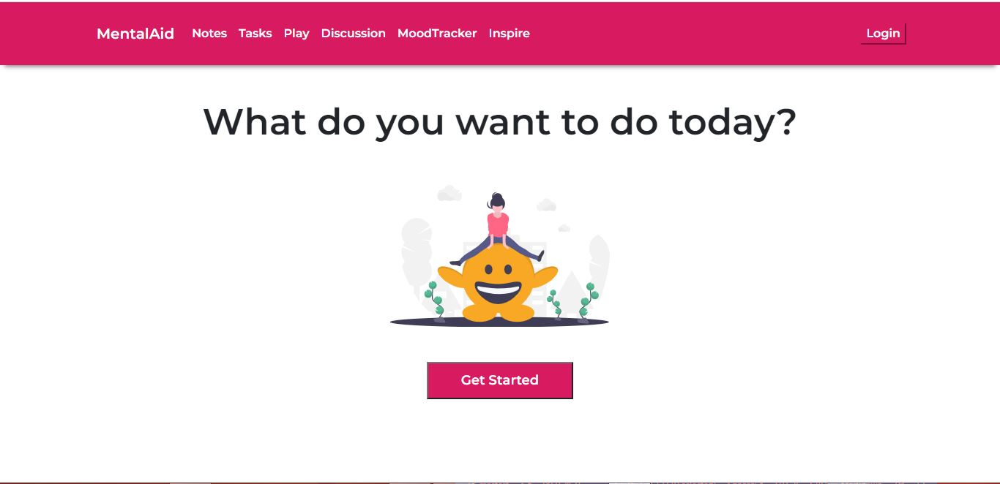
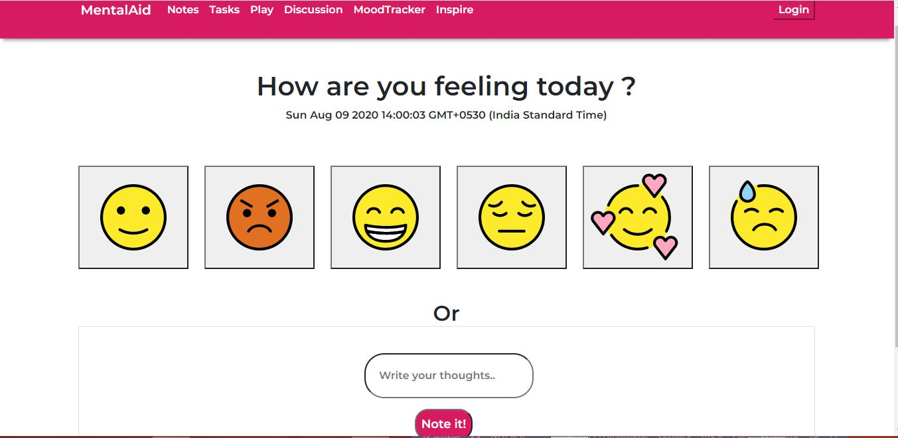

# *__Mental-Aid__*

Video Demo: https://youtu.be/38-wMch4Mr8

### Introduction and problem attempted to solve
According to the WHO,  
*__`Fear, worry, and stress are normal responses to perceived or real threats, and at times when we are faced with uncertainty or the unknown. So it is normal and understandable that people are experiencing fear in the context of the COVID-19 pandemic.
Added to the fear of contracting the virus in a pandemic such as COVID-19 are the significant changes to our daily lives as our movements are restricted in support of efforts to contain and slow down the spread of the virus. Faced with new realities of working from home, temporary unemployment, home-schooling of children, and lack of physical contact with other family members, friends and colleagues, it is important that we look after our mental, as well as our physical, health.`  __*

It is essential to ensure that we analyze our thought patterns, understand ourselves, and finally have some time to play 
and a dose of daily inspiration to keep us going. 

The desire to achieve this led to the 
development of Mental-Aid: A web application to help people with special mental needs

### Methodology
*__Module Wise Description__*  

`Module 1:`  
People who suffer from ailments like ADHD find it difficult to organize themselves and maintain important ideas or notes,  the first module, helps them to set-up notes, and access them whenever required. 

`Module 2:`  
The second module is a task manager, to setup tasks which are displayed in the standard workboard manner, making them easy to remember. 

`Module 3:` 
A module taking you to games which can be played to improve memory and give the much needed break  

`Module 4:`  
People are the greatest resource of knowledge and the have amazing stories to share,  this module helps people put up their special stories for the world to know :smile:

`Module-5`  
*__Mood tracking is a positive psychology technique for improving mental health where a person records their mood, usually at set time intervals, in order to help identify patterns in how their mood varies.__*
The fifth module is a mood tracker which helps you to keep track of your thought patterns,  thus allowing you to take better care of yourself.

`Module-6`  
A random quote generator to give you the daily dose of motivation!

### Technologies used
* React
* Firebase

### Challenges I ran into
Structuring the firebase realtime database, analysis of components helped me structure the database correctly.

### Running the project :running:
* Clone the repository and go to that directory.
* Install Yarn
* Run yarn install
* Run yarn start
* View it on http://localhost:3000

### Pitch
This product can also be used by mental health practitioners as an assistive technology.
